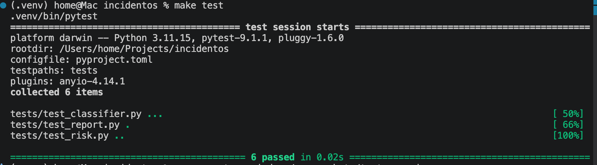
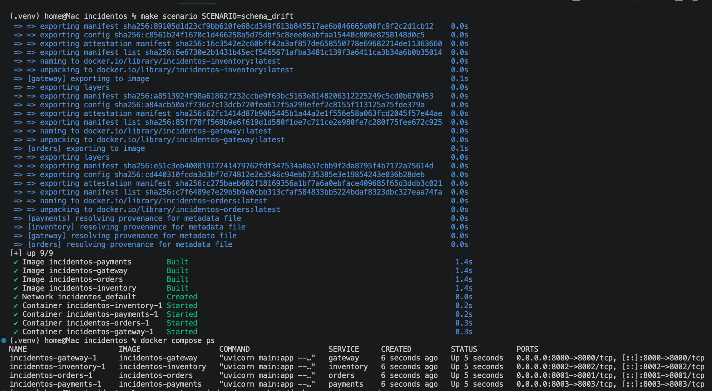
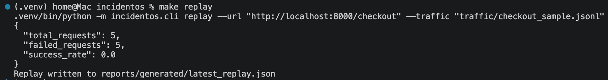
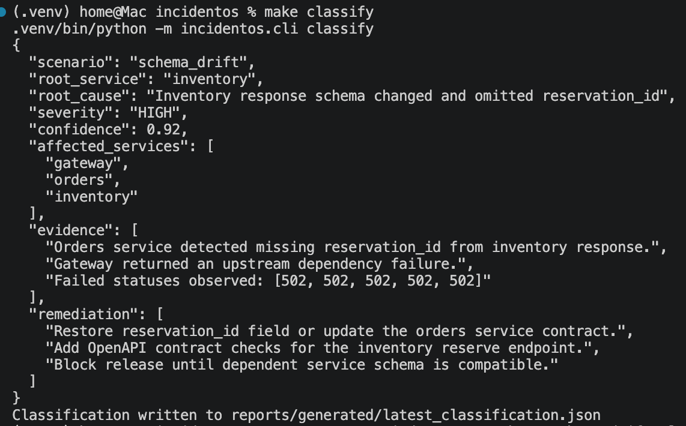
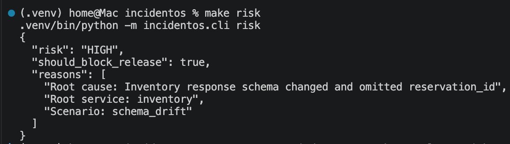

# FaultScene


FaultScene is a Dockerized microservice incident replay and root-cause analysis platform. It simulates production-style checkout failures across gateway, orders, inventory, and payments services, replays synthetic traffic, classifies likely root cause, and generates release-risk reports.

## Why This Exists

Production incidents often require engineers to inspect service logs, failed requests, dependency behavior, and recent changes before identifying root cause. FaultScene recreates that workflow in a local, repeatable environment.

This project demonstrates backend engineering, microservice debugging, API reliability, test automation, and production-support thinking.

## What This Demonstrates

- Dockerized microservice orchestration
- Synthetic traffic replay
- Failure scenario injection
- Root-cause classification
- Release-risk scoring
- Markdown incident report generation
- Pytest validation
- GitHub Actions CI

## Architecture

```text
traffic-replayer
       |
       v
gateway-service
       |
       v
orders-service
   |          |
   v          v
inventory   payments
```
## Demo: Schema Drift Incident

FaultScene simulates a schema drift incident where the inventory service omits the expected `reservation_id` field. The orders service detects the incompatible response contract, the gateway returns upstream dependency failures, and FaultScene classifies the root cause.

### Tests Passing



### Dockerized Microservices



### Traffic Replay



### Root-Cause Classification



### Release-Risk Gate


